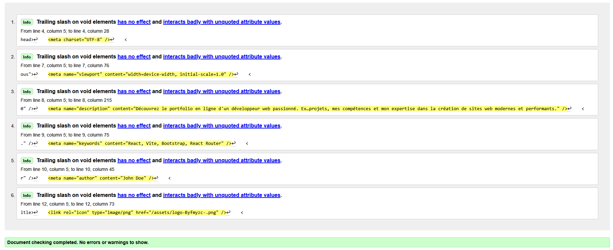
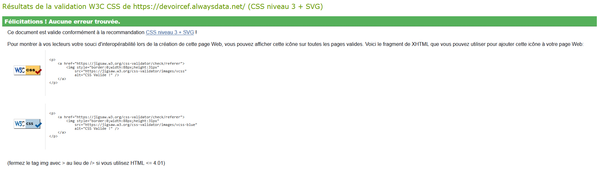

# OPTIMISEZ VOTRE CV EN LIGNE AVEC REACT.JS

##  Description
Ce projet permet de créer un **un site internet** et **responsive** avec React.js.

Basé sur un tutoriel React pour débutants, ce projet a pour objectifs :
- Apprendre React (Hooks, composants, styles…)

##  Fonctionnalités
- Affichage dynamique des données personnelles, expériences, compétences, projets…
- Design responsive pour mobile, tablette et desktop

##  Technologies utilisées
- React.js (Create React App ou Vite)
- Hooks React (useState, useEffect)
- CSS modulable (ou styled-components / CSS-in-JS)

##  Installation et utilisation
1. Clone le dépôt  
   ```bash
   git clone https://github.com/DarkSttew/OPTIMISEZ-VOTRE-CV-EN-LIGNE-AVEC-REACT.JS.git
   cd OPTIMISEZ-VOTRE-CV-EN-LIGNE-AVEC-REACT.JS
   ```
2. Installe les dépendances  
   ```bash
   npm install
   # ou
   yarn install
   ```
3. Lance le serveur de développement  
   ```bash
   npm start
   # ou
   yarn start
   ```
4. Ouvre [http://localhost:3000](http://localhost:3000) dans ton navigateur.

##  Ce site web est hébergé sur alwaysdata
- https://devoircef.alwaysdata.net/

## Validation HTML



## Validation CSS

